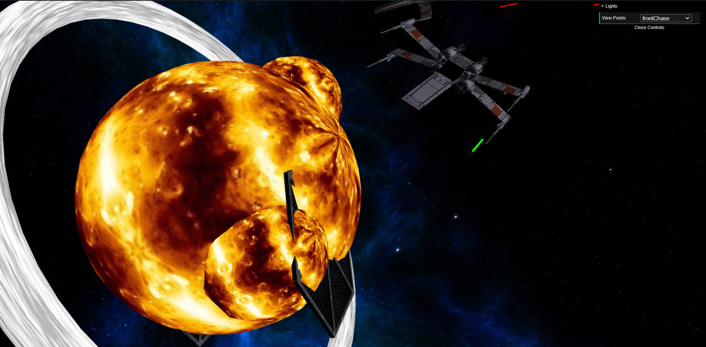
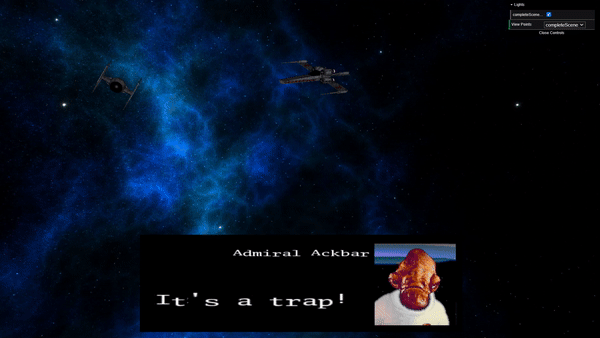
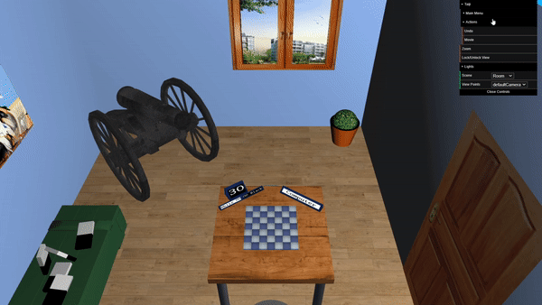
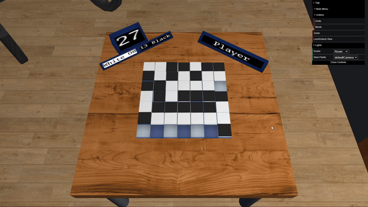

# LAIG Projects

[Try it out](https://joaoasousa.github.io/CGRA_2Y2S)

- **Project name:** – Projects developed for the LAIG course
- **Short description:** Two small projects depicting a Star Wars ship dog chase animation and a 3D interface for the board game [Taiji](https://boardgamegeek.com/boardgame/31926/taiji).
- **Institution:** [FEUP](https://sigarra.up.pt/feup/en/web_page.Inicial)
- **Course:** [LAIG](https://sigarra.up.pt/feup/en/ucurr_geral.ficha_uc_view?pv_ocorrencia_id=281214) (Graphical Applications Laboratory)
- **Project grades:** 
  *TP1:* 19.3/20.0
  *TP2:* 19.5/20.0
  *TP3:* ?/20.0
- **Group members:**
    - [João António Cardoso Vieira e Basto de Sousa](https://github.com/JoaoASousa) ([up201806613@fe.up.pt](up201806613@fe.up.pt))
    - [Rafael Soares Ribeiro](https://github.com/up201806330) ([up201806330@fe.up.pt](up201806330@fe.up.pt))

## Screenshots and Gameplay

### TP1

### TP2

### TP3

